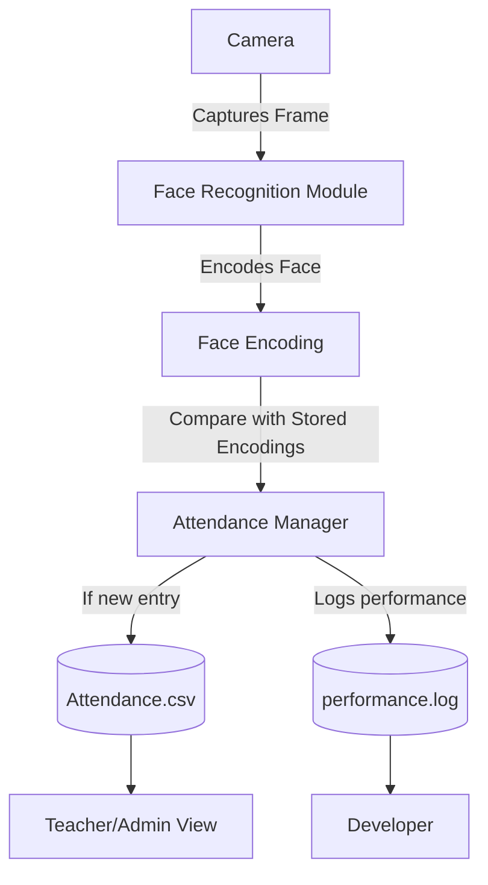

# Data Flow Diagram (DFD)

```mermaid
flowchart TD
    Camera -->|Captures Frame| FaceRecognition[Face Recognition Module]
    FaceRecognition -->|Encodes Face| Encoder[Face Encoding]
    Encoder -->|Compare with Stored Encodings| AttendanceCheck[Attendance Manager]
    AttendanceCheck -->|If new entry| CSV[(Attendance.csv)]
    AttendanceCheck -->|Logs performance| LogFile[(performance.log)]
    CSV --> Teacher[Teacher/Admin View]
    LogFile --> Developer[Developer]
```
