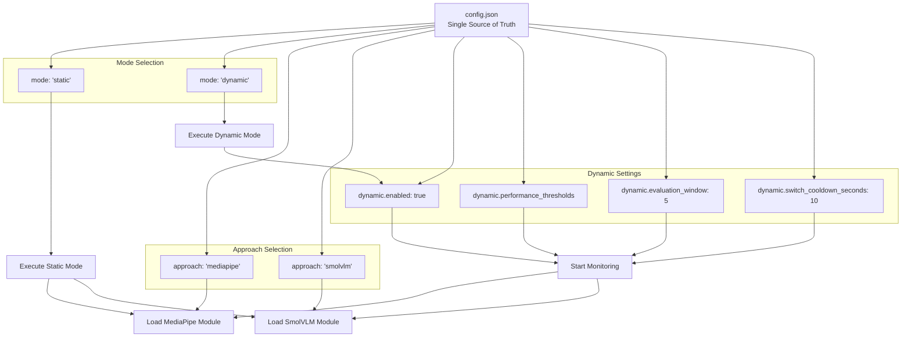

# Architecture Diagram

This document provides architecture diagram for the gesture recognition system.

```mermaid
graph TB
    CONFIG[config.json<br/>Single Source of Truth]
  
    subgraph "Mode Selection"
        MODE_STATIC[mode: 'static']
        MODE_DYNAMIC[mode: 'dynamic']
    end
  
    subgraph "Approach Selection"
        APP_MP[approach: 'mediapipe']
        APP_SMOL[approach: 'smolvlm']
    end
  
    subgraph "Dynamic Settings"
        DYN_ENABLED[dynamic.enabled: true]
        DYN_THRESH[dynamic.performance_thresholds]
        DYN_WINDOW[dynamic.evaluation_window: 5]
        DYN_COOLDOWN[dynamic.switch_cooldown_seconds: 10]
    end
  
    CONFIG --> MODE_STATIC
    CONFIG --> MODE_DYNAMIC
  
    CONFIG --> APP_MP
    CONFIG --> APP_SMOL
  
    CONFIG --> DYN_ENABLED
    CONFIG --> DYN_THRESH
    CONFIG --> DYN_WINDOW
    CONFIG --> DYN_COOLDOWN
  
    MODE_STATIC --> EXEC_STATIC[Execute Static Mode]
    MODE_DYNAMIC --> EXEC_DYNAMIC[Execute Dynamic Mode]
  
    APP_MP --> LOAD_MP[Load MediaPipe Module]
    APP_SMOL --> LOAD_SMOL[Load SmolVLM Module]
  
    EXEC_STATIC --> LOAD_MP
    EXEC_STATIC --> LOAD_SMOL
  
    EXEC_DYNAMIC --> DYN_ENABLED
    DYN_ENABLED --> MONITOR[Start Monitoring]
    DYN_THRESH --> MONITOR
    DYN_WINDOW --> MONITOR
    DYN_COOLDOWN --> MONITOR
  
    MONITOR --> LOAD_MP
    MONITOR --> LOAD_SMOL
```

