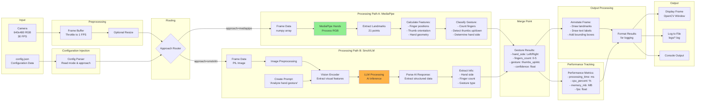
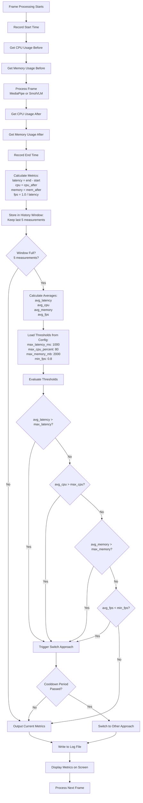

# Data Flow Diagrams

This document shows the data flow through the gesture recognition system.

## Overall Data Flow

```mermaid
flowchart LR
    subgraph "Input"
        CAM[Camera<br/>640x480 RGB<br/>30 FPS]
        CONFIG_DATA[config.json<br/>Configuration Data]
    end
  
    subgraph "Preprocessing"
        BUFFER[Frame Buffer<br/>Throttle to 1 FPS]
        RESIZE[Optional Resize]
    end
  
    subgraph "Configuration Injection"
        CONFIG_PARSER[Config Parser<br/>Read mode & approach]
    end
  
    subgraph "Routing"
        ROUTER{Approach Router}
    end
  
    subgraph "Processing Path A: MediaPipe"
        MP_INPUT[Frame Data<br/>numpy array]
        MP_PROCESS[MediaPipe Hands<br/>Process RGB]
        MP_LANDMARKS[Extract Landmarks<br/>21 points]
        MP_FEATURES[Calculate Features:<br/>- Finger positions<br/>- Thumb orientation<br/>- Hand geometry]
        MP_CLASSIFY[Classify Gesture:<br/>- Count fingers<br/>- Detect thumbs up/down<br/>- Determine hand side]
    end
  
    subgraph "Processing Path B: SmolVLM"
        SMOL_INPUT[Frame Data<br/>PIL Image]
        SMOL_PREPROC[Image Preprocessing]
        SMOL_VISION[Vision Encoder<br/>Extract visual features]
        SMOL_PROMPT[Create Prompt:<br/>'Analyze hand gesture']
        SMOL_AI[LLM Processing<br/>AI inference]
        SMOL_RESPONSE[Parse AI Response:<br/>Extract structured data]
        SMOL_EXTRACT[Extract Info:<br/>- Hand side<br/>- Finger count<br/>- Gesture type]
    end
  
    subgraph "Merge Point"
        RESULTS[Gesture Results:<br/>- hand_side: Left/Right<br/>- fingers_count: 0-5<br/>- gesture: thumbs_up/etc<br/>- confidence: float]
    end
  
    subgraph "Performance Tracking"
        METRICS[Performance Metrics:<br/>- processing_time: ms<br/>- cpu_percent: %<br/>- memory_mb: MB<br/>- fps: float]
    end
  
    subgraph "Output Processing"
        ANNOTATE[Annotate Frame:<br/>- Draw landmarks<br/>- Draw text labels<br/>- Add bounding boxes]
        FORMAT_RESULTS[Format Results<br/>for logging]
    end
  
    subgraph "Output"
        DISPLAY[Display Frame<br/>OpenCV Window]
        LOG_FILE[Log to File<br/>logs/*.log]
        CONSOLE[Console Output]
    end
  
    CAM --> BUFFER
    CONFIG_DATA --> CONFIG_PARSER
    BUFFER --> RESIZE
    RESIZE --> ROUTER
    CONFIG_PARSER --> ROUTER
  
    ROUTER -->|approach=mediapipe| MP_INPUT
    ROUTER -->|approach=smolvlm| SMOL_INPUT
  
    MP_INPUT --> MP_PROCESS
    MP_PROCESS --> MP_LANDMARKS
    MP_LANDMARKS --> MP_FEATURES
    MP_FEATURES --> MP_CLASSIFY
    MP_CLASSIFY --> RESULTS
  
    SMOL_INPUT --> SMOL_PREPROC
    SMOL_PREPROC --> SMOL_VISION
    SMOL_PROMPT --> SMOL_VISION
    SMOL_VISION --> SMOL_AI
    SMOL_AI --> SMOL_RESPONSE
    SMOL_RESPONSE --> SMOL_EXTRACT
    SMOL_EXTRACT --> RESULTS
  
    RESULTS --> METRICS
    RESULTS --> ANNOTATE
    ANNOTATE --> FORMAT_RESULTS
  
    METRICS --> FORMAT_RESULTS
    FORMAT_RESULTS --> DISPLAY
    FORMAT_RESULTS --> LOG_FILE
    FORMAT_RESULTS --> CONSOLE
  
    style MP_PROCESS fill:#90EE90
    style SMOL_AI fill:#FFB347
```

## Performance Data Flow

```mermaid
flowchart TD
    START_FRAME[Frame Processing Starts]
  
    START_FRAME --> RECORD_START[Record Start Time]
  
    RECORD_START --> GET_CPU_BEFORE[Get CPU Usage Before]
    GET_CPU_BEFORE --> GET_MEM_BEFORE[Get Memory Usage Before]
  
    GET_MEM_BEFORE --> PROCESS_FRAME[Process Frame<br/>MediaPipe or SmolVLM]
  
    PROCESS_FRAME --> GET_CPU_AFTER[Get CPU Usage After]
    GET_CPU_AFTER --> GET_MEM_AFTER[Get Memory Usage After]
  
    GET_MEM_AFTER --> RECORD_END[Record End Time]
  
    RECORD_END --> CALCULATE[Calculate Metrics:<br/>latency = end - start<br/>cpu = cpu_after<br/>memory = mem_after<br/>fps = 1.0 / latency]
  
    CALCULATE --> STORE_HISTORY[Store in History Window:<br/>Keep last 5 measurements]
  
    STORE_HISTORY --> CHECK_WINDOW{Window Full?<br/>5 measurements?}
  
    CHECK_WINDOW -->|No| OUTPUT_METRICS[Output Current Metrics]
  
    CHECK_WINDOW -->|Yes| CALC_AVERAGES[Calculate Averages:<br/>avg_latency<br/>avg_cpu<br/>avg_memory<br/>avg_fps]
  
    CALC_AVERAGES --> LOAD_THRESHOLDS[Load Thresholds from Config:<br/>max_latency_ms: 1000<br/>max_cpu_percent: 80<br/>max_memory_mb: 2000<br/>min_fps: 0.8]
  
    LOAD_THRESHOLDS --> EVAL_THRESHOLDS[Evaluate Thresholds]
  
    EVAL_THRESHOLDS --> CHECK1{avg_latency > max_latency?}
    CHECK1 -->|Yes| TRIGGER_SWITCH[Trigger Switch Approach]
    CHECK1 -->|No| CHECK2{avg_cpu > max_cpu?}
  
    CHECK2 -->|Yes| TRIGGER_SWITCH
    CHECK2 -->|No| CHECK3{avg_memory > max_memory?}
  
    CHECK3 -->|Yes| TRIGGER_SWITCH
    CHECK3 -->|No| CHECK4{avg_fps < min_fps?}
  
    CHECK4 -->|Yes| TRIGGER_SWITCH
    CHECK4 -->|No| OUTPUT_METRICS
  
    TRIGGER_SWITCH --> CHECK_COOLDOWN{Cooldown Period<br/>Passed?}
  
    CHECK_COOLDOWN -->|No| OUTPUT_METRICS
    CHECK_COOLDOWN -->|Yes| SWITCH_APPROACH[Switch to Other Approach]
  
    OUTPUT_METRICS --> WRITE_LOG[Write to Log File]
    SWITCH_APPROACH --> WRITE_LOG
  
    WRITE_LOG --> DISPLAY_METRICS[Display Metrics on Screen]
  
    DISPLAY_METRICS --> NEXT_FRAME[Process Next Frame]
```

