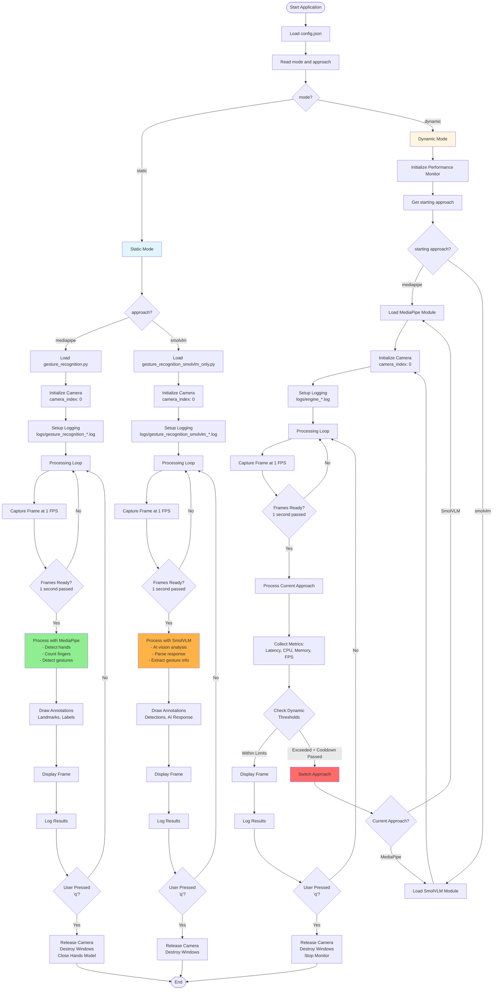

# Execution Flowchart

This document shows the execution flowchart for the gesture recognition system.

## Main Execution Flow

## Execution Summary

### Static Mode - MediaPipe
1. Load config → Read mode="static", approach="mediapipe"
2. Initialize MediaPipe hands detector
3. Setup camera and logging
4. Process frames at 1 FPS
5. Detect hands, count fingers, classify gestures
6. Display and log results
7. Exit on 'q' press

### Static Mode - SmolVLM
1. Load config → Read mode="static", approach="smolvlm"
2. Load SmolVLM model
3. Setup camera and logging
4. Process frames at 1 FPS
5. Query SmolVLM, parse AI response
6. Display and log results
7. Exit on 'q' press

### Dynamic Mode
1. Load config → Read mode="dynamic"
2. Initialize performance monitor with thresholds
3. Load starting approach (mediapipe or smolvlm)
4. Setup camera and logging
5. Process frames at 1 FPS
6. Monitor performance metrics continuously
7. Switch approach if thresholds exceeded
8. Display and log results
9. Exit on 'q' press
